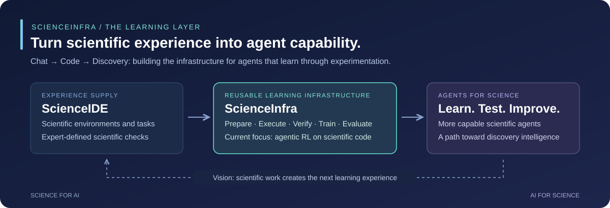

<div align="center">

# ScienceInfra

### 面向发现智能的开放学习基础设施

**将科学经验转化为智能体能力。**

[English](README.md) · [简体中文](README.zh-CN.md)

[论文](https://arxiv.org/abs/2609.19134) · [ScienceIDE](https://github.com/aitofound/ScienceIDE) · [快速开始](#快速开始) · [发展路线](#发展路线) · [技术文档](#技术文档)

</div>

**ScienceInfra 是面向科学智能体训练与评测、持续建设的基础设施项目。** 它源于 [ScienceIDE](https://github.com/aitofound/ScienceIDE) 的训练与评测组件，连接科学任务库、容器化执行、可验证奖励与智能体学习。

| 项目 | 核心定位 |
|---|---|
| **[ScienceIDE](https://github.com/aitofound/ScienceIDE)** | 将科学代码与领域知识转化为可执行环境和经过验证的任务。 |
| **ScienceInfra** | 将这些环境接入可复用的训练与评测流程，长期建设执行、验证与学习系统。 |

我们的目标是让科学经验成为发展 **Discovery Intelligence（发现智能）** 的可规模化资源，持续拓展对不同科学环境、Agent Harness 和学习方法的支持。



## 本库的独有价值

- **面向学习的科学反馈。** 将可执行的科学检查接入奖励，代码修复支持考虑未修复基线的部分得分。
- **长程智能体训练。** 接入异步 GRPO，显式处理长短不一的任务轨迹与预算截断。
- **可靠执行与评测。** 区分基础设施故障与模型结果，支持容器缓存预热和独立的模型评测。
- **可复用的接入接口。** 分离任务包、Agent Loop 与奖励接口，当前集成 PSRL、Harbor 和 vLLM。

当前版本覆盖 **任务准备 → 智能体执行 → 在线 RL → 评测**，内置 LAPS 与 MITgcm-biogeo 两个演示环境。实现细节与实验结果见[使用指南](USAGE.zh-CN.md)。

## 快速开始

从内置 LAPS 环境开始。验证执行链路需要 **Python 3.11+、Docker 和 Harbor**，无需模型或 GPU。

```bash
git clone https://github.com/Gen-Verse/ScienceInfra.git
cd ScienceInfra
pip install -e .

bash scripts/prepare/prepare_all.sh \
    --repo demo --envs laps --stages compile,lines,dataset

bash scripts/eval/eval_standalone.sh \
    --dataset data/laps/repair_easy/all/L1.parquet \
    --agent oracle --limit 1 -n 1 --output-dir outputs/anchor_oracle
```

Oracle 检查的预期得分为 **1.0**。Nop 基线检查、PSRL 安装与训练步骤见[完整指南](USAGE.zh-CN.md#快速开始)。RL 启动脚本面向集群，需要按实际硬件调整。

## 发展路线

**ScienceIDE 是起点，ScienceInfra 将长期建设科学智能体学习所需的共用基础设施。**

| 方向 | 后续建设重点 |
|---|---|
| **规模化执行** | 可复用环境镜像、缓存复用，以及面向昂贵科学任务的资源调度。 |
| **可靠科学验证** | 有效性检查、细粒度奖励诊断与任务隔离验证。 |
| **更多学习流程** | 轨迹导出、SFT 接入，以及更多训练框架和 Harness 适配。 |
| **跨环境学习** | 课程与采样机制、留出代码库评测，以及将学习反馈用于任务开发。 |
| **更丰富的科学任务** | 将学习流程从代码修复扩展到参数校准、实现、加速与多步骤研究。 |

以上为发展方向，当前已支持的能力见前文。欢迎共同建设可服务于不同科学领域和后续研究项目的基础设施。

## 技术文档

| 指南 | 内容 |
|---|---|
| [使用指南](USAGE.zh-CN.md) | 安装、演示、实验结果、训练配置与排障 |
| [任务准备](scienceinfra/datasets/README.md) | 任务库编译、数据划分与缓存预热 |
| [RL 方案](scienceinfra/rl/README.md) | Agent Loop、科学奖励、预算处理与训练诊断 |
| [评测指南](scienceinfra/eval/README.md) | 基线、模型评测与输出格式 |
| [内置演示](demo/README.md) | LAPS 与 MITgcm-biogeo 环境 |

模块指南目前为英文。

## 参与共建

欢迎贡献**科学环境接入、执行系统、Verifier、训练适配器与评测方案**。[提交 Issue](https://github.com/Gen-Verse/ScienceInfra/issues) 或[发起 PR](https://github.com/Gen-Verse/ScienceInfra/pulls)。新环境请附 Oracle/Nop 检查结果；学习相关改动请说明奖励、数据划分与预算。

⭐ 欢迎 Star，关注后续版本，共建面向发现智能的开放基础设施。

## 引用与致谢

科学环境、方法与论文实验结果请引用 [ScienceIDE](https://arxiv.org/abs/2609.19134)。使用 ScienceInfra 时，也请附上本仓库链接与实验使用的 Commit。

<details>
<summary>BibTeX</summary>

```bibtex
@article{geng2026scienceide,
  title={ScienceIDE: Turning World's Scientific Codebase into Agent Learnable Environments},
  author={Geng, Hejia and Huang, Zesen and Li, Haoyang and Li, Wenbin and Wu, Koutian and Zhou, Zihan and Pang, Yuanbo and Liu, Weihao and Xu, Zigong and Li, Zhiping and Zhang, Zongzheng and Dong, Chuanfei and Sun, Jiankai and Zheng, Tianzhe and Xie, Fengyu and Ma, Yue and Shi, Yueheng and Xie, Tong and Di, Zonglin and Liu, Xianrong and Gao, Qucheng and Liu, Yimin and Pan, Jiaming and Huang, Sheng and Ma, Xiao-Han and Yuan, Lanqing and Zhu, Zhenlin and Liu, Ziang and Xu, Ziyang and Wang, Junkai and Liang, Kangkai and Xian, Jiayi and Zhao, Zehong and Xu, Liuwei and Xie, Jingxu and Zhang, Peijin and Gao, Qiang and Xing, Chengyi and Zhao, Zhe and Wang, Xi and Xing, Yaopeng and Meng, Xing and Yin, Zhenfei and Wu, Yingcheng and Yang, Ling},
  journal={arXiv preprint arXiv:2609.19134},
  year={2026}
}
```

</details>

基于 [PSRL](https://github.com/psrl-project/psrl)、[Harbor](https://github.com/laude-institute/harbor) 与 [vLLM](https://github.com/vllm-project/vllm) 构建。感谢 [PKU-DAIR](https://github.com/PKU-DAIR) 的支持与合作，其提供了 RL infra 的支持。感谢 ScienceIDE 贡献者与科学软件维护者。

**许可证：** [Apache 2.0](LICENSE)。第三方科学代码库遵循各自的许可证。
