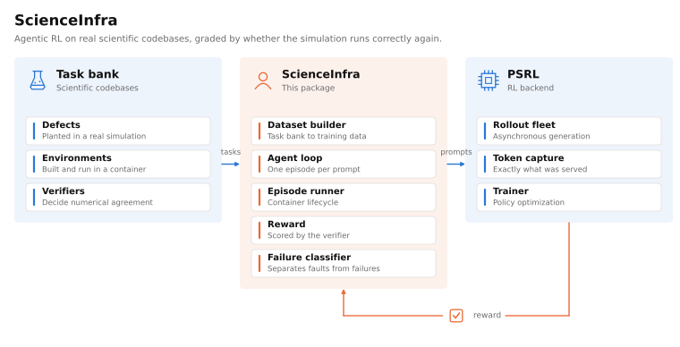
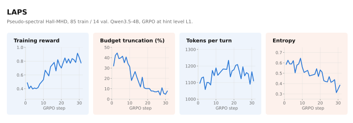
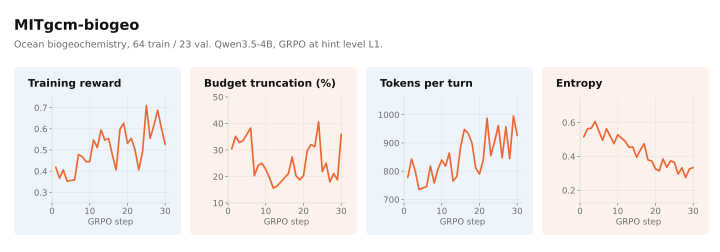

# ScienceInfra Usage Guide

[Back to README](README.md) · [简体中文](USAGE.zh-CN.md)

## Architecture

<details>
<summary><strong>View the execution and training architecture</strong></summary>



PSRL supplies asynchronous rollout management, token capture, weight transfer, and the GRPO trainer. Harbor executes the episodes. vLLM serves model generations. ScienceInfra supplies the scientific-task integration above these components.

</details>

## Results

**Scientific feedback improves held-out verifier reward in two scientific environments.**

The ScienceIDE paper evaluates **Qwen3.5-4B**, starting from the base checkpoint without SFT initialization, after 30 GRPO steps:

| Environment | Scientific setting | Evaluated held-out tasks | Base reward | After RL | Gain |
|---|---|---:|---:|---:|---:|
| **LAPS** | Pseudo-spectral Hall-MHD | 14 | 0.357 | **0.857** | **+0.500** |
| **MITgcm-biogeo** | Ocean biogeochemistry | 21 | 0.286 | **0.571** | **+0.285** |

These are **mean shaped verifier rewards on a 0 to 1 scale**, with partial credit. Base and RL checkpoints use matched harnesses and localization hints. The comparisons are within each training environment, with one run per environment. They do not establish transfer to unseen codebases or repeated-seed uncertainty. The unhinted ScienceIDE-Hard leaderboard is a separate evaluation.

<details>
<summary><strong>Training curves and recipe details</strong></summary>





The source split for MITgcm-biogeo contains 23 validation tasks. The paper's held-out comparison above evaluates 21. Training diagnostics and held-out evaluation therefore have distinct sample counts.

See the [RL recipe](scienceinfra/rl/README.md) for budget masking and training diagnostics. Regenerate the figures with `python -m scienceinfra.plotting.rl_training`. Their metric tables are committed in that module.

</details>

## Quickstart

Start by validating one scientific environment. Training and model serving require additional compute and backend setup.

### 1. Install and prepare the inputs

- **Python 3.11+** for this package. Use the compatible Python/CUDA environment required by your PSRL installation for training.
- **Docker** on every machine that runs episodes, plus Harbor installed in the active Python environment.
- **A scientific task bank.** [`demo/`](demo/README.md) ships two, so no separate checkout is needed to run the steps below. For the full collection of scientific environments and tasks, see [ScienceIDE](https://github.com/aitofound/ScienceIDE).
- **[PSRL](https://github.com/psrl-project/psrl#-quick-start)** and its serving/training dependencies for the RL and model-evaluation paths.

<details>
<summary><strong>Install PSRL from source</strong></summary>

PSRL is not on PyPI. Install it from source first, following its [installation guide](https://github.com/psrl-project/psrl#-quick-start):

```bash
# Rust is a build prerequisite.
curl --proto '=https' --tlsv1.2 -sSf https://sh.rustup.rs | sh
source "$HOME/.cargo/env"

conda create -n psrl python=3.12 && conda activate psrl

git clone https://github.com/psrl-project/psrl.git && cd psrl
bash scripts/install_basic.sh        # vLLM, veRL, core deps
bash scripts/install_nixl.sh         # RDMA weight sync
bash scripts/install_megatron.sh     # Megatron, TransformerEngine
bash scripts/install_lmcache.sh      # LMCache
python -m pip install -e .           # PSRL itself
```

A Docker image is also available, which skips the build steps entirely. Check the [PSRL README](https://github.com/psrl-project/psrl) for the current tag.

</details>

```bash
git clone https://github.com/Gen-Verse/ScienceInfra.git
cd ScienceInfra
pip install -e .
```

Install ScienceInfra in each worker environment so Ray can import the agent loop by its package path. The installation above installs this package's dependencies. It does not install the full PSRL stack.

### 2. Build one environment

The bundled LAPS demo needs no external checkout and no GPU.

```bash
bash scripts/prepare/prepare_all.sh \
    --repo demo --envs laps --stages compile,lines,dataset
```

This compiles the authored tasks into Harbor tasks and writes Parquets to `data/laps/repair_easy/`. For the MITgcm demo, substitute `--envs mitgcm-biogeo` after restoring its binary inputs, which [`demo/README.md`](demo/README.md) explains.

Generated Parquets contain absolute task paths. Make those paths available wherever episodes execute. The [preparation guide](scienceinfra/datasets/README.md) covers multi-node cache warming and rebuilds.

### 3. Check execution without a model or GPU

```bash
# One task first. Drop --limit 1 to validate the whole environment.
bash scripts/eval/eval_standalone.sh \
    --dataset data/laps/repair_easy/all/L1.parquet \
    --agent oracle --limit 1 -n 1 --output-dir outputs/anchor_oracle

bash scripts/eval/eval_standalone.sh \
    --dataset data/laps/repair_easy/all/L1.parquet \
    --agent nop --limit 1 -n 1 --output-dir outputs/anchor_nop
```

Expected normalized repair scores: **oracle = 1.0, nop = 0.0**. The first execution also builds container images, so allow time for compilation. Resolve failed anchors before measuring a model.

### 4. Run the RL recipe

The committed launcher uses **3 nodes × 8 GPUs: 8 for generation and 16 for training**. Configure the deployment block in [`train_grpo.sh`](scripts/rl/train_grpo.sh) and your PSRL/Ray cluster for your hardware before launching. This is a cluster recipe. Warm task images on every episode node using the preparation guide.

```bash
HF_MODEL_PATH=/absolute/path/to/Qwen3.5-4B \
DATA_DIR="${PWD}/data/mitgcm-biogeo/repair_easy" \
HINT_LEVEL=L1 \
    bash scripts/rl/train_grpo.sh
```

For saved-checkpoint evaluation, use the [evaluation guide](scienceinfra/eval/README.md). Match hints, thinking mode, context window, and turn budget when comparing runs. The training and standalone evaluation defaults differ.

## Troubleshooting

<details>
<summary><strong>Troubleshooting and operational notes</strong></summary>

- **Behind an HTTP proxy, configure it for the builder, not just your shell.** BuildKit does not inherit shell proxy variables, so the first task image stalls in `apt-get install` for as long as the build timeout allows, with no error. Add a `proxies` block to `~/.docker/config.json` and confirm a build can reach the network before blaming the task:
  ```bash
  printf 'FROM debian:bookworm-slim\nRUN apt-get update && echo APT_OK\n' > /tmp/px/Dockerfile
  docker build --progress=plain -t px /tmp/px | grep APT_OK
  ```
  A local Debian mirror is the alternative: see `scienceinfra/configs/apt-mirror-override.yaml` and `to_harbor.py --apt-mirror`.
- **A degraded Docker daemon is the most common cause of a stalled run.** It does
  not announce itself, and `docker ps -q` can exit 0 while the daemon is dead.
  Check all three before launching, and exclude any failing node with
  `AGENT_NODE_IPS`:
  ```bash
  ps -o args= -p $(pgrep -o dockerd)                  # must not say <defunct>
  timeout 20 docker info | grep -A2 'Registry Mirrors' # must print, if you use one
  timeout 20 docker ps -q | wc -l                      # must not hang
  ```
- **`network_mode='allowlist' is not supported` at trial init is a host problem,
  not a task problem.** Harbor gates egress control on a probe that runs a
  container, so a broken daemon or an unreachable registry disables the allowlist
  and the task is then correctly rejected. Fix the daemon rather than downgrading
  the task to `public`, which would let the agent diff against public upstream and
  silently inflate scores.
- **`oracle` and `nop` must anchor before any model number means anything.** A
  score measured against a broken verifier is worse than no score.
- **`eval/unhinted.parquet` is a different task from `eval/L1.parquet`.** Scoring a
  hint-trained checkpoint against it looks like catastrophic regression, and is
  really a task change.
- **Warm the image cache per node before training.** The buildkit cache is
  node-local, and a cold node spends 8 to 15 minutes on its first build per task.
- **Keep warm concurrency low.** Each episode compiles a scientific codebase and
  fans out further, so a high value starves the containers' own reference runs past
  their timeout, which looks like broken tasks rather than contention.

</details>

